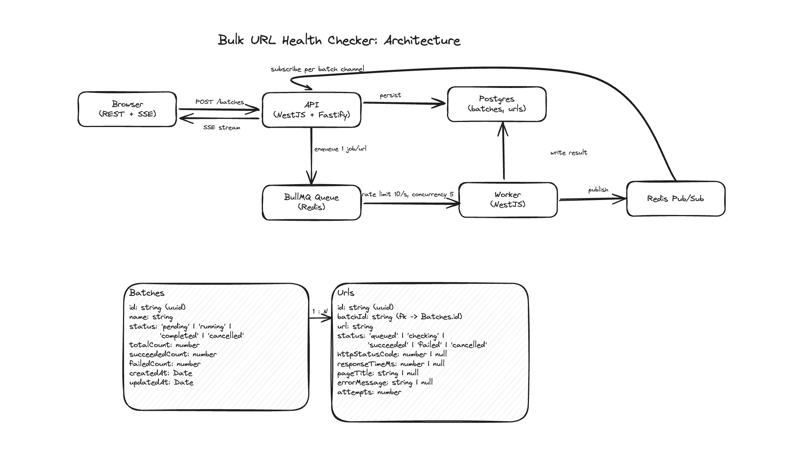

# Bulk URL Health Checker

A batch URL health-checking system. Submit a list of URLs (pasted or via CSV), a background
worker checks each one, and progress streams live to the UI. Batch and job state survive a page
refresh, a dropped SSE connection, or a second browser tab. Rate limit, concurrency, and retry
guarantees hold regardless of how many worker processes are running.

---

## What it does

1. **Accepts a batch** of URLs, either pasted directly or uploaded as a CSV, via a presigned S3
   upload (two-step request/complete)
2. **Persists batches and URLs to Postgres before enqueueing any job**, `status: queued`
3. **Checks each URL** in a separate worker process, subject to a global rate limit and a global
   concurrency cap that hold across any number of worker processes
4. **Retries transient failures** (3 attempts, exponential backoff), marking a URL failed only
   once retries are exhausted
5. **Streams progress live** over SSE, with a full state reconciliation on every connect/reconnect
6. **Supports cancel and retry-failed** as first-class, idempotent batch operations
7. **Caches the batch list** for 30 seconds, cache-aside, invalidated on every write that changes
   what it shows

---

## Architecture



Request flow through the API, Postgres, BullMQ, the worker, and Redis, plus the `Batches`/`Urls`
schema.

Each app is documented in its own README with its exact folder structure, run command, and
testing notes: [apps/api](apps/api/README.md), [apps/worker](apps/worker/README.md),
[apps/web](apps/web/README.md), [packages/shared-contracts](packages/shared-contracts/README.md).

### Request flow

1. `POST /batches` (paste) or the two-step presigned-upload flow (CSV) persists the batch and
   every URL row to Postgres, `status: queued`, in one transaction.
2. The API enqueues one BullMQ job per URL, using each URL row's own id (generated in application
   code) as the job id.
3. The worker processes jobs, subject to the global rate limit and concurrency cap.
4. Each job result is written to Postgres, then published on a Redis pub/sub channel scoped to
   that batch.
5. A connected SSE client receives the update live. A client that opens or reconnects instead gets
   a full reconciliation read from Postgres.

### Global concurrency and rate limiting

- **Concurrency: 5 in-flight checks, system-wide, across any number of worker processes.**
  Enforced by `RedisSemaphoreService` (`apps/worker/src/redis/redis-semaphore.service.ts`), a
  Lua-scripted atomic counter (`INCR`-if-below-limit, `EXPIRE`, `DECR`) keyed in Redis, acquired
  before every check and released in a `finally`.
- **Rate limit: 10 requests/second, system-wide.** Enforced via BullMQ's built-in `limiter`
  Worker option, backed by a Redis-stored counter scoped to the queue.

### SSRF protection

URL _format_ is validated at the API boundary (`class-validator`'s `IsUrl`, `http`/`https` only,
required protocol, on both the paste and CSV ingestion paths), but format alone doesn't stop a
request to an internal address, a hostname the checker has never seen can still resolve to one via
DNS rebinding. `SsrfGuardUtil` (`apps/worker/src/security/ssrf-guard.util.ts`) resolves the
hostname to its actual IP and rejects private/reserved ranges: loopback, RFC1918, and link-local
(which covers the `169.254.169.254` cloud metadata endpoint). `UrlCheckerUtil` follows redirects
manually (`redirect: 'manual'`, up to `MAX_REDIRECTS`) and re-runs the guard on every hop, since a
URL that resolves safely can still redirect to one that doesn't.

### Idempotency

Every URL row's id is generated in application code, before the insert, and reused as the BullMQ
`jobId`. BullMQ refuses to add a job whose id already exists in any state, including `failed`,
which makes both a duplicate "create batch" request and a retried job idempotent by construction.

### Live updates (SSE + Redis pub/sub)

Batch and URL updates are published on a per-batch Redis pub/sub channel and forwarded to
connected SSE clients. Multiple API instances can each hold a different browser's connection for
the same batch; Redis pub/sub fans the update out to whichever instance is holding it.

### Caching

The batch list is cached for 30 seconds, cache-aside, in Redis. Every write that changes what the
list shows (create, cancel, retry, and the worker's own status-flip to `completed`) deletes the
cache key directly. The worker publishes its own invalidation over Redis pub/sub, since it has no
direct access to the API's cache manager.

---

## Horizontal scaling behavior

| Scaling axis              | Behavior                                                                                                                                                                                                                                                           |
| ------------------------- | ------------------------------------------------------------------------------------------------------------------------------------------------------------------------------------------------------------------------------------------------------------------ |
| Multiple API instances    | Postgres is the single source of truth for batch/URL state. The 30s batch-list cache lives in Redis, shared across instances. SSE connections are pinned to one instance; Redis pub/sub fans updates to all instances regardless of which one published the event. |
| Multiple worker processes | The BullMQ rate limiter and the Redis-backed semaphore keep the 10 req/s and 5-in-flight limits true regardless of worker count.                                                                                                                                   |

---

## What I'd do differently

### Architecture-level

- **Redis Pub/Sub's at-most-once delivery.** Redis Streams instead of Pub/Sub, for guaranteed
  delivery with consumer groups and replay.
- **Per-host politeness.** The rate limit and concurrency cap are both global across every host,
  with no robots.txt check and no per-host backoff.

### Scope cuts

- **Auth and multi-tenancy.** Out of scope for this task. Every batch is visible to everyone.
- **Earlier, decentralized CSV validation.** Validation is currently server-side only, after the
  full file has already round-tripped through S3. A client-side pre-check plus an
  S3-event-triggered edge validator would catch bad files earlier and cover the case where
  "complete upload" is never called.
- **Distributed tracing.** OpenTelemetry spans carrying a trace id across API, Redis, worker, and
  Postgres, instead of correlating pino logs by batch id manually.

### Testing gaps

- `CancelBatchCommandHandler` has no test suite (`RetryFailedBatchCommandHandler` does).
- `UrlCheckerUtil`, the fetch/timeout/title-extraction logic, has no isolated test coverage.
- `useCreateBatchForm` and `useCsvUploadForm` (frontend) have no test coverage.
- No CI pipeline.
- No load or chaos testing. Current coverage proves the rate-limit/concurrency mechanism is
  correct, not its behavior under sustained real-world load.

---

## Technology Stack

| Layer                       | Technology                                                                                                              |
| --------------------------- | ----------------------------------------------------------------------------------------------------------------------- |
| Runtime                     | Node.js 20+ / TypeScript, NestJS (`apps/api`, `apps/worker`)                                                            |
| Web framework               | Fastify (`apps/api`), Next.js App Router (`apps/web`)                                                                   |
| Database                    | PostgreSQL 16, MikroORM                                                                                                 |
| Queue                       | BullMQ, Redis-backed                                                                                                    |
| Cache / pub-sub / semaphore | Redis (three distinct uses)                                                                                             |
| Object storage              | S3-compatible, LocalStack locally                                                                                       |
| Live updates                | Server-Sent Events + Redis pub/sub                                                                                      |
| Frontend data layer         | TanStack Query, orval-generated client from the API's OpenAPI spec                                                      |
| Validation                  | class-validator / class-transformer                                                                                     |
| Architecture pattern        | CQRS (`@nestjs/cqrs`)                                                                                                   |
| Package manager             | pnpm workspaces                                                                                                         |
| Testing                     | Vitest, Suites (`@suites/unit`) for automocking, testcontainers for Postgres/Redis, Storybook + storyshots (`apps/web`) |

---

## Getting Started

Requires Docker. The commands below also need Node 20+ and pnpm, only for the local-development
path, not the Docker one.

### Fastest way to run it

```bash
docker compose up -d --build
```

Builds and starts everything together: Postgres, Redis, LocalStack, the API, the worker, and the
web app.

- Web app: http://localhost:4000
- API: http://localhost:3000 (Swagger docs at `/api/docs`)

No separate install step, this builds the apps inside their own containers.

### Local development (native processes, faster iteration)

```bash
# macOS / Linux
bash scripts/prerequisites.sh

# Windows (PowerShell)
./scripts/prerequisites.ps1
```

Checks Node and Docker, installs pnpm if it's missing.

```bash
pnpm bootstrap   # copies .env.example -> .env, installs deps, starts Postgres/Redis/LocalStack, builds shared-contracts
pnpm dev         # starts the API, the worker, and the web app together as native processes
```

- API: http://localhost:3000 (Swagger docs at `/api/docs`)
- Web app: check the `next dev` terminal output for the port. Defaults to 3000, auto-shifts to the
  next free port (usually 3001) if the API is already on 3000.

`pnpm bootstrap` never overwrites an existing `.env` file.

### Environment variables

Each app's `.env.example` documents what it needs. `pnpm bootstrap` copies them to `.env` (or
`.env.local` for the web app). All values are local-dev defaults.

---

## Project Structure

```
apps/
  api/                     NestJS + Fastify. HTTP only, no BullMQ processor. CQRS commands/queries, SSE endpoint.
  worker/                  NestJS application context, no HTTP listener. Hosts the BullMQ processor.
  web/                     Next.js App Router. BFF proxy route + an orval-generated react-query client.
packages/
  shared-contracts/        MikroORM entities, DTOs, constants, and utils shared by api and worker.
docs/
  diagrams/
    architecture.excalidraw   request flow + Batches/Urls schema, open at excalidraw.com
scripts/
  prerequisites.sh         checks/installs Node, pnpm, Docker (macOS/Linux)
  prerequisites.ps1        same, for Windows
  setup.sh                 pnpm bootstrap: env files, deps, Docker services, builds shared-contracts
```

---

## Testing

```bash
pnpm test        # everything, in every app/package
```

| App                       | Commands                                                                                                                                                                                                                                                  |
| ------------------------- | --------------------------------------------------------------------------------------------------------------------------------------------------------------------------------------------------------------------------------------------------------- |
| `apps/api`, `apps/worker` | `pnpm test:unit`: mocked, automocked via Suites, no external services. `pnpm test:it`: Postgres and Redis via testcontainers. `pnpm test:e2e`: reserved; controller/SSE tests that boot a real `NestFastifyApplication` currently live under `test:unit`. |
| `apps/web`                | `pnpm test`: hook tests (TanStack Query cache via `queryMocks`) plus a Storybook "storyshots" snapshot pass. `pnpm storybook`: browse components at http://localhost:6006.                                                                                |
